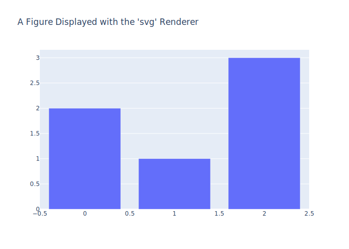
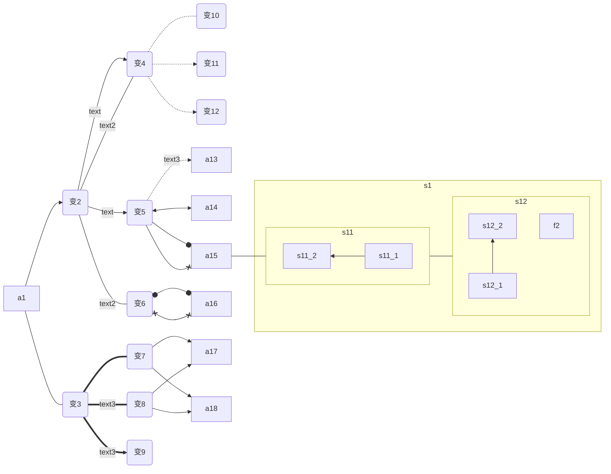
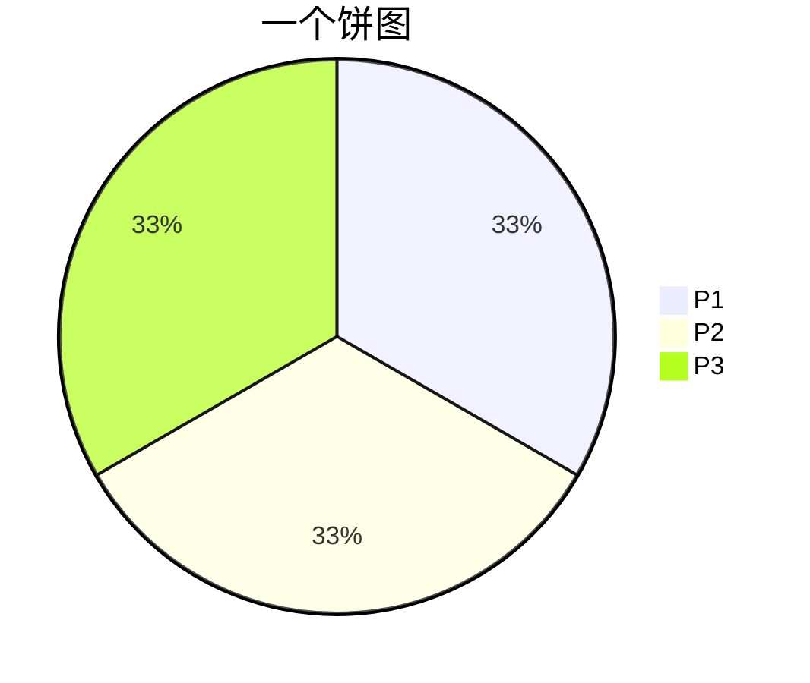
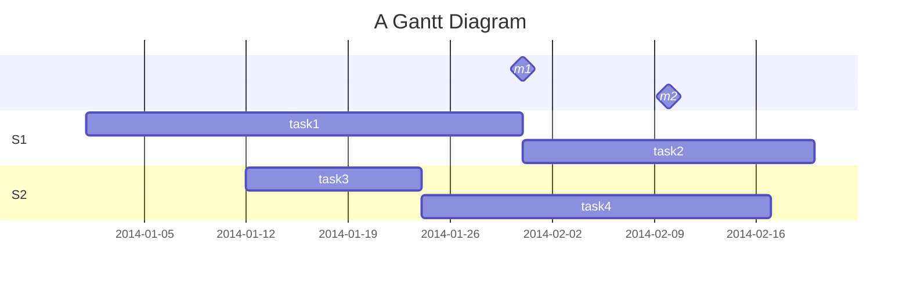

- [1 文本段落](#1-文本段落)
  - [1.1 文本](#11-文本)
  - [1.2 段落](#12-段落)
  - [1.3 表格](#13-表格)
  - [1.4 列表](#14-列表)
  - [1.5 区块](#15-区块)
- [2 链接和图片](#2-链接和图片)
- [3 支持HTML](#3-支持html)
  - [3.1 基本html](#31-基本html)
  - [3.2 进阶html](#32-进阶html)
- [4 mermaid](#4-mermaid)
  - [流程图](#流程图)
  - [饼图](#饼图)
  - [甘特图](#甘特图)

!!! summary
    总结：<https://kz16.top/md/>

!!! warning
    警告

!!! Note
    标注

# 1 文本段落
## 1.1 文本
*斜体文本*
_斜体文本_
**粗体文本**
__粗体文本__
***粗斜体文本***
___粗斜体文本___  
~~带删除线文本~~
<u>带下划线文本</u>
行内`代码`  
```
代码块
```  

## 1.2 段落
Markdown 段落没有特殊的格式，直接编写文字就好，段落的换行是使用两个以上空格加上回车。当然也可以在段落后面使用一个空行来表示重新开始一个段落。
用 --- 或 *** 可以产生出一条分割线：前空行或中间空格 
- - -

## 1.3 表格
| 左对齐 | 右对齐 | 居中对齐 |
| :----- | -----: | :------: |
| 单元格 | 单元格 |  单元格  |
| 单元格 | 单元格 |  单元格  |

## 1.4 列表
有序列表使用数字并加上 . 号来表示；无序列表使用星号(*)、加号(+)或是减号(-)作为列表标记。列表嵌套只需在子列表中的选项前面添加两个或四个空格即可，这些标记后面要添加一个空格：
1. 第一项：
    - 第一项嵌套的第一个元素
    - 第一项嵌套的第二个元素
2. 第二项：
    - 第二项嵌套的第一个元素
    - 第二项嵌套的第二个元素

## 1.5 区块
Markdown 区块引用是在段落开头使用 > 符号 ，然后后面紧跟一个空格符号：
> 最外层
> > 第一层嵌套
> > > 第二层嵌套

列表项目内放进区块需要在 > 前添加四个空格的缩进，列表中使用区块实例如下：
* 第一项
    > 菜鸟教程
    > 学的不仅是技术更是梦想
* 第二项

# 2 链接和图片
链接语法格式如下
```
[链接名称](链接地址)
或者
<链接地址>
```
图片语法格式如下：svg、png、gif等等
```  


```


脚注
创建脚注格式类似这样 [^1]。
[^1]: 脚注1

# 3 支持HTML
## 3.1 基本html
| 常用HTML标签 | 一般格式为： <标签名> 文本 </标签名>                         |
| ------------ | ------------------------------------------------------------ |
| 换行         | <br> </br>                                                   |
| 加粗         | <b>加粗<b>                                                   |
| 斜体         | <i>斜体<i>                                                   |
| 下划线       | <u>下划线<u>                                                   |
| 删除线       | <del>删除线</del>                                            |
| 加亮         | <mark>加亮</mark>                                            |
| 超链接       | <a href=‘链接指向地址’>超链接</a>href=“xxx”:指定链接的目标。 |
| 文本下角     | 文本<sub>下角<sub>                                           |
| 文本上角     | 文本<sup>上角</sup>                                          |
| 小字体       | <small>小字体</small>                                        |
| 大字体       | <big>大字体</big>                                            |
| 打字机文本   | <tt>打字机文本</tt>                                          |
| 插入图片 | |
| 插入音视频 | <iframe src="链接地址" scrolling="no" border="0" frameborder="no" framespacing="0" allowfullscreen="true"> </iframe>，同时还可以通过添加属性" style="VISIBILITY: hidden"来隐藏iframe，看上去就像是背景音乐一样|

## 3.2 进阶html
<details>
<summary>点我查看折叠内容</summary>
- 我是折叠菌内容
- 我是折叠菌内容
</details>

<marquee>我是文字滚动菌</marquee>


<div style="height: 80px; overflow-y: scroll;">

这种上下局部滚动可以适用于长代码块 
第1行
第2行
第3行
第4行
第5行
第6行
...
</div>

<div style="display: flex; overflow-x: scroll;">

这种可以适用于长公式
$x=\sqrt{a+b+c+d+e+f+g+a+b+c+d+e+f+g+a+b+c+d+e+f+g+a+b+c+d+e+f+g+a+b+c+d+e+f+g+a+b+c+d+e+f+g+a+b+c+d+e+f+g+a+b+c+d+e+f+g+a+b+c+d+e+f+g}$
</div>

打印分页：
<div STYLE="page-break-after: always;"></div>

# 4 mermaid
参考地址
<https://mermaidjs.github.io/>
<https://github.com/knsv/mermaid>

## 流程图
> Possible FlowChart orientations are:
> TB - top to bottom
> TD - top-down/ same as top to bottom
> BT - bottom to top
> RL - right to left
> LR - left to right

> 元素外框：默认方形
    id1[方形]
    id2(圆边矩形)
    id3([体育场形])
    id4[[子程序形]]
    id5[(圆柱形)]
    id6((圆形))
	id7{菱形}
	id8{{六角形}}
	id9[/平行四边形/]
	id10[\反向平行四边形\]
	id11[/梯形\]
	id12[\反向梯形/]

> 连接原则：元素左侧至少三个符号；备注左侧至少两个符号。
> Length:	1	；2	；3
> Normal:	---	；----	；-----
> qiNormal with arrow:	-->	；--->	；---->
> Thick:	===	====	=====
> Thtick with arrow:	==>	；===>	；====>
> Dotted:	-.-	；-..-	；-...-
> Dotted with arrow:	-.->	；-..->	；-...->
> 其他（未起作用？）: --o；--x；o--o；x--x；<-->；；



## 饼图


## 甘特图
> The following formatting options are supported:
Input       Example             Description:
YYYY        2014                4 digit year
YY          14                  2 digit year
Q           1..4                Quarter of year. Sets month to first month in quarter.
M MM        1..12               Month number
MMM MMMM    January..Dec        Month name in locale set by moment.locale()
D DD        1..31               Day of month
Do          1st..31st           Day of month with ordinal
DDD DDDD    1..365              Day of year
X           1410715640.579      Unix timestamp
x           1410715640579       Unix ms timestamp
H HH        0..23               24 hour time
h hh        1..12               12 hour time used with a A.
a A         am pm               Post or ante meridiem
m mm        0..59               Minutes
s ss        0..59               Seconds
S           0..9                Tenths of a second
SS          0..99               Hundreds of a second
SSS         0..999              Thousandths of a second
Z ZZ        +12:00              Offset from UTC as +-HH:mm, +-HHmm, or Z
More info in: <https://momentjs.com/docs/#/parsing/string-format/>



